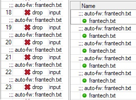

# MikroTik auto-fw
## About
I work as a systems administrator for a major hosting company. We have quite a bit of issues with different attacks, be it common wordpress attack vectors (xmlrpc, wp-login, authors, database) or just plain DoS/DDoS attacks, or any other (port probing, form spam, SSH or FTP attacks and many, many more), we have it. Over the time, I've compiled a list of IP ranges or companies, that usually cause the most trouble. 

Since I use MikroTik devices exclusively (because they are awesome!), and I host some services on my home network myself, they are (unfortunately) being exposed to these attacks. I've decicided to create this collection of scripts that will automatically update my router's firewall rules based on some iplists and settings I provide. Since the premise of all of this is expandability and modularity, you can decide which services and networks to block. You can select from curated, pre-compiled lists of known subnets that cause troubles, or specify your own. If you don't want to just block, but have lots of IP addresses or IP ranges, this script can also be used to simply manage your MikroTik's firewall rules by a script.

## Usage
### Install dependencies
I keep the dependency list in `requirements.txt`. That means you need to simply run `pip install -r requirements.txt` and all shall be done automagically for you.
### Generate IP list
First of all, you need to decide which IP lists to use/block. You can head over to [lists](https://github.com/ApplePie420/mikrotik-auto-fw/tree/main/lists) to see more detailed info. There is a table with all available IP lists, with their names and short description.

When you are decided on which lists to use, you can execute `python generate_iplist.py`. This visual script is really simple to use - use your arrow keys to navigate the list and space to select one or more options. Then, hit tab to select "Generate IP list" button and confirm with enter. A message with "Success" text should appear, and you can exit the script by hitting enter again. Alternatively if your terminal supports it, you can use your mouse to click around.

This should generate `settings.json` file with appropriate formatting required for the next step.

Adding custom IP lists is __not yet__ supported.

### Apply rules to firewall
#### Edit .env file
There is a sample `.env.sample` file that contains example data that needs to be filled in and replaced. First of all, rename this file to `.env`, otherwise python will not find it. Next up, fill in the data in this file, currently the IP address of your router, username and password that'll be used to log-in via SSH into your router. SSH keys are __not yet__ supported.

#### Run the script
Next, run the `add_to_firewall.py` script. There is no need to pass it anything, the script will simply load IP lists from `config.json` file, and execute appropriate commands on the MikroTik hardware. You'll get a verbose output to stdout from MikroTik directly. 

### MikroTik rules
Each rule is commented, for example if you've decided to block all `frantec` IPs, the rule will have `auto-fw: frantech.txt` comment attached to it both in Filter Rules and in Address Lists, see winbox screenshot below:

